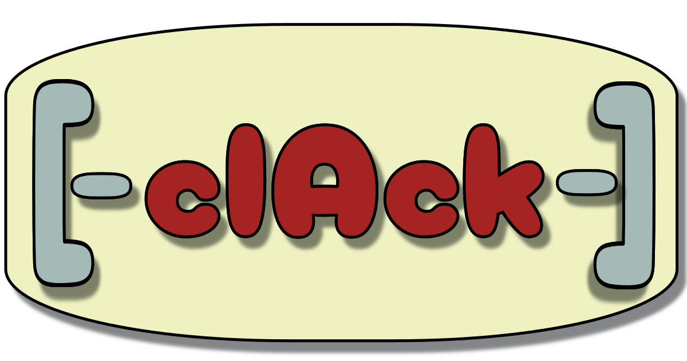

# clack - Command Line Args and Configuration Kit



**_clack_** is a modern C++20/23 library designed to simplify working with command line arguments and configuration 
files. It provides a structured, type-safe approach to defining and processing command line options and 
configurations, while also supporting the generation and consumption of configuration files in various formats 
(JSON, YAML, TOML, etc.).

## Features

- **Structure-Based Definition**: Define command line arguments and configuration settings using simple C++ 
structs.
- **Compile-Time Extensibility**: Append additional options and configurations at compile-time using a flexible 
API.
- **Configuration File Support**: Generate configuration files from your struct definitions and load them back 
into your application.
- **External Format Hooks**: Integrate with external libraries to support popular formats like JSON, YAML, and 
TOML.
- **Type Safety**: Strong type safety throughout the entire process of defining, parsing, and validating 
arguments and configurations.
- **Custom Validation**: Define custom validation rules for your arguments and configurations.
- **Cross-Platform Compatibility**: Works seamlessly across different platforms and compilers.

## Installation

To use clack in your project:

1. Clone the repository:
   ```bash
   git clone https://github.com/yourusername/clack.git
   ```
2. Include the necessary headers in your project:
   ```cpp
   #include <clack.hpp>
   ```
3. Build your project with a C++20/23 compliant compiler.

## Usage

### Defining Command Line Arguments

Define command line arguments using a simple struct:

```cpp
#include <clack.hpp>

struct Args {
    CLACK_DEFARGS(
        ("help", 'h', "Show this help message")
        ("config", 'c', "Path to configuration file", std::string, "config.json")
        ("verbose", 'v', "Enable verbose output", bool, false)
    )
};
```

Parse command line arguments:

```cpp
int main(int argc, char** argv) {
    Args args;
    clack::parse_args(argc, argv, args);

    if (args.help) {
        // Print help message
    }

    return 0;
}
```

### Working with Configuration Files

Define configuration options alongside command line arguments:

```cpp
struct Config {
    CLACK_CONFIG(
        ("database.host", "localhost", "Database host address")
        ("database.port", 5432, "Database port number")
        ("database.user", std::string, "postgres")
    )
};
```

Generate and save a configuration file:

```cpp
Config config;
clack::save_config(config, "config.json");
```

Load configuration from a file:

```cpp
clack::load_config("config.json", config);
```

### Combining Command Line and Configuration

Combine command line arguments and configurations in a single struct:

```cpp
struct AppSettings {
    CLACK_DEFARGS(
        ("help", 'h', "Show this help message")
        ("config", 'c', "Path to configuration file", std::string, "config.json")
    )
    
    CLACK_CONFIG(
        ("database.host", "localhost", "Database host address")
        ("database.port", 5432, "Database port number")
    )
};

int main(int argc, char** argv) {
    AppSettings settings;
    
    // Parse command line arguments
    clack::parse_args(argc, argv, settings);
    
    // Load configuration from file
    if (!settings.help && !settings.config.empty()) {
        clack::load_config(settings.config, settings);
    }
    
    return 0;
}
```

### Custom Format Support

Extend clack to support custom formats by implementing hooks:

```cpp
// Example hook for JSON support using nlohmann::json
template<typename T>
void save_json(const T& obj, const std::string& path) {
    // Implementation here
}

template<typename T>
void load_json(T& obj, const std::string& path) {
    // Implementation here
}
```

## API Reference

### Main Classes and Functions

- `clack::defargs`: Define command line arguments.
- `clack::config`: Define configuration options.
- `clack::parse_args`: Parse command line arguments into a struct.
- `clack::save_config`: Save configuration settings to a file.
- `clack::load_config`: Load configuration settings from a file.

### Hooks

Extend clack's functionality by implementing hooks for custom formats:

```cpp
template<typename T>
void save_format(const T& obj, const std::string& path) {
    // Custom saving logic
}

template<typename T>
void load_format(T& obj, const std::string& path) {
    // Custom loading logic
}
```

## Getting Help

- **Documentation**: Comprehensive documentation is available in the 
[Wiki](https://github.com/yourusername/clack/wiki).
- **Issues**: Report bugs or suggest features on [GitHub Issues](https://github.com/yourusername/clack/issues).
- **Community**: Join our community on [Discord](https://discord.gg/yourserver) or other platforms.

## License

clack is licensed under the MIT License. See [LICENSE](LICENSE) for details.

## Contributions

Contributions are welcome! Please read our [CONTRIBUTING.md](CONTRIBUTING.md) file for guidelines on how to 
contribute.

---

Join us in making clack even better! 🚀
